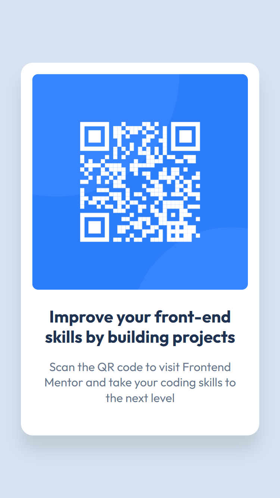

# Frontend Mentor - QR code component solution

This is a solution to the [QR code component challenge on Frontend Mentor](https://www.frontendmentor.io/challenges/qr-code-component-iux_sIO_H). Frontend Mentor challenges help you improve your coding skills by building realistic projects.

## Table of contents

- [Overview](#overview)
  - [Screenshot](#screenshot)
  - [Links](#links)
- [My process](#my-process)
  - [Built with](#built-with)
  - [What I learned](#what-i-learned)
  - [Continued development](#continued-development)
- [Author](#author)
- [Acknowledgments](#acknowledgments)

## Overview

QR Code Challenge using Flexbox

### Screenshot




### Links

- Live Site URL: [Netlify](https://stirring-medovik-d9f841.netlify.app)

## My process

I started with the desktop version of it and then I adjusted the mobile version from that. I started out with writing out the HTML first, adding all of the elements first and then I styled it using CSS. I used responsive units and media query to develop the mobile version of it.

### Built with

- Semantic HTML5 markup
- Flexbox
- VS Code

### What I learned

What I learned from this project is developing a habit of using proper semantics, like using them when it's necessary, and it helped me practice a bit of responsive design. Additionally, it helped me understand Flexbox and containers more.

Here are some of the semantics and media query I used:

```html
<main class="container">
  <article class="qr-card">
    
    <p class="qr-header">Improve your front-end skills by building projects</p>
    <p class="qr-text">
      Scan the QR code to visit Frontend Mentor and take your coding skills to
      the next level
    </p>
  </article>
</main>
```

```css
@media (max-width: 23.5em) {
  .qr-card {
    width: 85%;
  }

  .qr-img {
    margin-bottom: 2.1rem;
  }

  .qr-header {
    font-size: 2.25rem;
    margin-bottom: 1.6rem;
  }

  .qr-text {
    font-size: 1.6rem;
  }
}
```

### Continued development

In the future, I would like to practice the when and where to use semantics, learning how to be better using flexbox and CSS Grid, create more responsive websites, and developing my own effecient workflow. I would also like to learn JavaScript when I've gained more experience with HTML and CSS.

## Author

- Website - [This is my design portfolio](https://www.projectsamson.com)
- Frontend Mentor - [@winterlamppost](https://www.frontendmentor.io/profile/winterlamppost)

## Acknowledgments

Big thanks to Jonas Schmedtmann! He has a great course on Udemy about HTML and CSS, without him, it would have been harder for me to learn HTML and CSS. Also thank you to the people who made frontendmentor.io possible. Thanks to you guys I'm able to practice my HTML and CSS skills.
